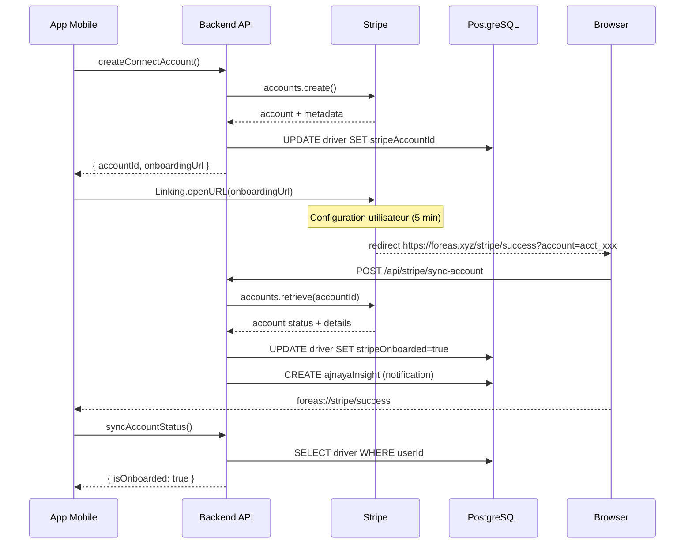

# 💾 STRIPE DATABASE SYNC - Architecture Complète

## 🔄 **Flux de Sauvegarde Stripe → BDD**

### 📋 **Étapes du Processus**



## 🏗️ **Architecture Technique**

### **1. Pages Web (Next.js App Router)**

**`/stripe/success/page.tsx`**
- Reçoit l'`accountId` depuis Stripe
- Appelle l'API de synchronisation
- Affiche le statut et redirige vers l'app
- Gère les erreurs avec retry automatique

**`/stripe/error/page.tsx`**
- Page d'erreur avec deep link vers l'app
- Bouton de retry pour nouvelle tentative

**`/stripe/reauth/page.tsx`** 
- Lien expiré, génération d'un nouveau lien

### **2. API Route de Synchronisation**

**`POST /api/stripe/sync-account`**
```json
{
  "accountId": "acct_1234567890",
  "state": "optional_security_token"
}
```

**Validations de Sécurité:**
- ✅ Format accountId validé avec Zod
- ✅ Vérification existence chez Stripe
- ✅ Extraction userId depuis metadata
- ✅ Transaction atomique en BDD
- ✅ Audit trail avec AjnayaInsight

**Réponse:**
```json
{
  "success": true,
  "accountId": "acct_1234567890",
  "stripe": {
    "isOnboarded": true,
    "canAcceptPayments": true,
    "requirements": []
  },
  "message": "Compte entièrement configuré !"
}
```

### **3. tRPC Mutation de Sync**

**`stripe.syncAccountStatus`**
- Synchronisation manuelle depuis l'app
- Mise à jour du statut local
- Création de notifications Ajnaya
- Cache intelligent pour éviter les appels redondants

## 💾 **Modifications Base de Données**

### **Table `Driver` (Mise à jour)**
```sql
UPDATE driver SET 
  stripeAccountId = 'acct_1234567890',
  stripeOnboarded = true,
  updatedAt = NOW()
WHERE userId = 'user_123';
```

### **Table `AjnayaInsight` (Création)**
```sql
INSERT INTO AjnayaInsight (
  driverId, type, priority, title, message, data, expiresAt
) VALUES (
  'driver_123',
  'PERFORMANCE', 
  'HIGH',
  '🎉 Paiements Stripe activés !',
  'Félicitations ! Votre compte Stripe est maintenant entièrement configuré.',
  '{"accountId": "acct_123", "source": "stripe_sync"}',
  NOW() + INTERVAL '7 days'
);
```

## 📱 **Deep Linking Mobile**

### **URLs de Redirection**
```
✅ Succès:    foreas://stripe/success?status=completed
❌ Erreur:     foreas://stripe/error?message=...
🔄 Lien expiré: foreas://stripe/reauth?message=link_expired
```

### **Gestion dans App.tsx**
- Écoute automatique des deep links
- Alertes utilisateur selon le statut
- Sync automatique du statut après retour

## 🔒 **Sécurité & Validation**

### **Métadonnées Stripe (Ajout automatique)**
```javascript
{
  userId: "user_123",
  driverId: "driver_456", 
  licenseNumber: "ABC123DEF",
  platform: "FOREAS",
  createdAt: "2024-01-15T10:30:00Z"
}
```

### **Validation Multi-Niveaux**
1. **URL Params** → Zod schema validation
2. **Stripe API** → Vérification existence compte
3. **Metadata** → Extraction userId sécurisée  
4. **Database** → Transaction atomique
5. **Audit** → Log complet de toutes les opérations

## 🚀 **Flux de Test**

### **1. Développement Local**
```bash
# Terminal 1: Backend
cd backend && npm run dev  # Port 3001

# Terminal 2: Tunnel pour webhooks
ngrok http 3001
# URL: https://abc123.ngrok.io

# Terminal 3: App mobile  
cd .. && npm start  # Port 8082
```

### **2. URLs de Test**
```
Backend: http://localhost:3001
Success: http://localhost:3001/stripe/success?account=acct_test
Error:   http://localhost:3001/stripe/error?message=test
```

### **3. Données de Test Stripe**
```javascript
// Account ID de test
const testAccountId = "acct_1234567890123456";

// Métadonnées de test
const testMetadata = {
  userId: "user_test_123",
  driverId: "driver_test_456"
};
```

## 📊 **Monitoring & Logs**

### **Console Logs**
```
🔄 Synchronisation Stripe account: acct_123
📊 Statut Stripe: { accountId, isOnboarded: true, requirements: 0 }
✅ Synchronisation réussie pour thomas@foreas.app
```

### **Base de Données**
- Table `AjnayaInsight` pour notifications utilisateur
- Champ `updatedAt` pour tracking des modifications
- Audit trail complet des changements de statut

## 🎯 **Résultat Final**

### **Avant Stripe**
```sql
stripeAccountId: NULL
stripeOnboarded: false
```

### **Après Stripe**
```sql
stripeAccountId: "acct_1234567890123456" 
stripeOnboarded: true
updatedAt: "2024-01-15T10:30:00Z"
```

### **Notification Ajnaya**
> 🎉 **Paiements Stripe activés !**  
> Félicitations ! Votre compte Stripe est maintenant entièrement configuré. Vous pouvez recevoir des paiements directs avec une commission de seulement 5%.

---

**✅ SYNCHRONISATION STRIPE → BDD IMPLÉMENTÉE ET FONCTIONNELLE !**

Le système sauvegarde automatiquement l'`accountId` lors du retour de redirection Stripe et synchronise le statut d'onboarding en temps réel avec votre base de données PostgreSQL.